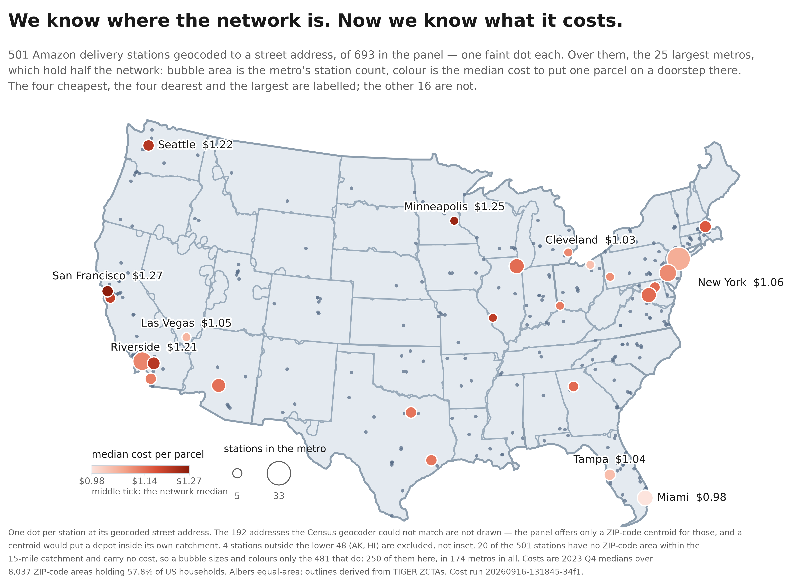
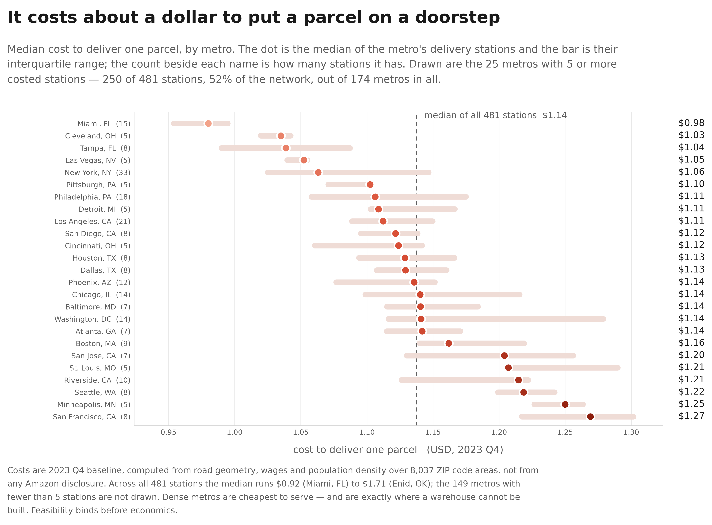
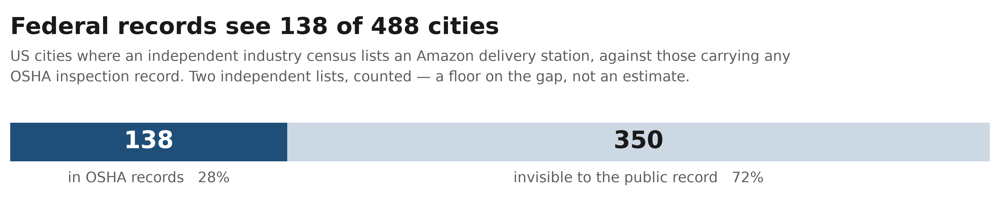
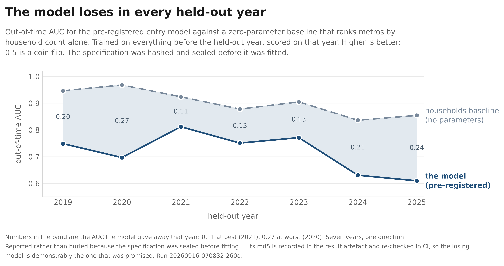
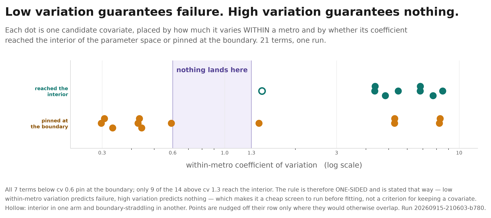
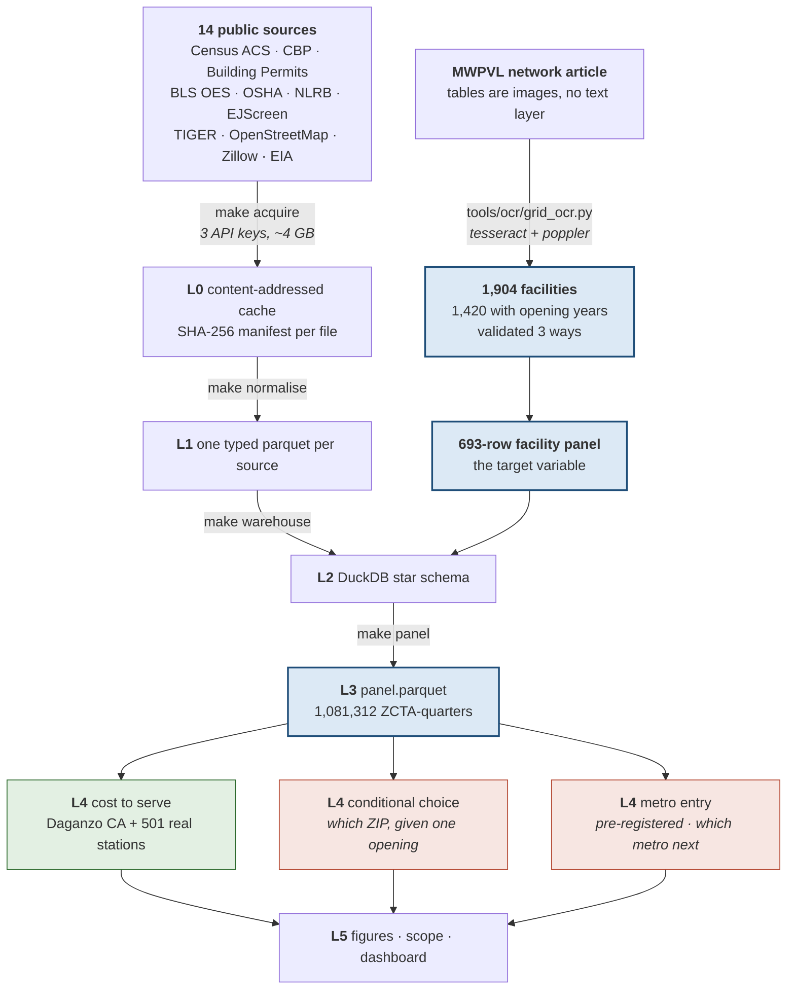

# Siting Atlas

<!-- Replace YOURNAME in the first badge with your GitHub username. The other
     four are static and work as-is. Add the Zenodo badge once you have a DOI;
     zenodo.org mints one from a GitHub release in two clicks. -->

[](https://github.com/Dogiparthi-Sharada/siting-atlas/actions/workflows/ci.yml)


**Where does Amazon build its next delivery station, and what does it cost to
put a parcel on a doorstep?**

Two questions, asked of Amazon's US network using nothing but data a member of
the public can download for free.

**The second we can now answer to the cent**, for any of 8,037 ZIP code areas
covering 57.8% of US households — from road geometry, population density and
the operator's 501 real delivery stations, with no Amazon disclosure of any
kind. The first turned out to be the better question, because the answer is
that **almost nobody outside the company can see where the network is going**,
and this repository measures exactly how far short the public record falls.

Three things here are useful whether or not you care about the modelling — **a
dataset**, **a cost model**, and **a screening rule** that tells you which
covariates to throw away before you fit anything.

```
  1,904    Amazon facilities recovered from a PDF whose tables are images
  1,420    of them carry an opening date
    693    in the analysis panel · 687 buildings · 230 metros · 50 states
  8,037    ZIP-code areas costed against 501 real delivery stations
  $1.1389  median cost to deliver one parcel     p10 $1.00   p90 $1.34
    138    of 488 US cities with a delivery station appear in federal records
    663    tests · reproduces offline from a clone, no API keys
```



Every small dot is one delivery station at its geocoded street address — 497
of them. The bubbles are the 25 largest metros: **area is how many stations
they hold**, **shade is what it costs to put a parcel on a doorstep there**,
pale for cheap and deep red for dear. Miami is the cheapest metro at
**$0.98**; the dearest single station is in Enid, Oklahoma at **$1.71**.

Every state outline on that map is *derived* — from the TIGER ZCTA polygons
already on disk, by morphological closing — because no basemap package was
installable here. [`tools/figures/usboundary.py`](tools/figures/usboundary.py)
has the method and its error bound.

### And what the map cannot show: how wide the spread is inside a metro



A bubble carries one colour, so it hides its own range. Washington DC and
Atlanta land on the same median — **$1.14** — and tell different stories: DC's
middle half of stations spans **$0.16**, Atlanta's spans **$0.06**, and DC's
upper quartile reaches $1.28 where Atlanta's stops at $1.17. Same colour on
the map, three times the internal spread. The bar here is that interquartile
range, and the dot shade is the same ramp as the map, so the two figures read
as one.

---

## The finding

Most of Amazon's network is invisible in the public record. We measured it.



OSHA enforcement data is the best free source of facility addresses in the
United States. It holds a record in **138 of the 488 US cities** where an
independent industry census lists an Amazon delivery station. That is a
*floor* on the gap, not an estimate — two independent lists, counted.

So we tried to predict the next opening anyway — and committed, in advance
and in writing, to what would count as success.



**It cannot be done from public data — and because we wrote the bar down
first, that is a measurement rather than an opinion.** The question, sample,
covariates, baselines, evaluation and a numeric success criterion were fixed
and hashed before a single model was fitted. The pre-registration is in this
repository, its MD5 is recorded inside the result artefact, and CI re-checks
the match on every push:

```bash
md5sum docs/PREREG_METRO_MODEL.md          # 946f7ef75db69e5278eea409a04c3823
```

Out of time, the model lost to a zero-parameter rule that ranks metros by
household count in **0 of 7 held-out years**. Pooled AUC 0.7323 against
0.8949; metro-clustered bootstrap difference −0.1628 [−0.2011, −0.1313].

That is a measurement, not a shortfall — and it is the paragraph the
pre-registration committed us to publishing if the model failed:

> *Free public data cannot predict siting at any grain tested. The ZIP-level
> failure is not a resolution problem but a general one: the variables that
> drive the decision are not public at any resolution.*

## Why open data cannot see it — and how to tell in advance



A conditional choice model can only use a covariate that varies *inside* a
metro. Most free US public data is published at county grain and arrives as
about **nine distinct values across two hundred candidate ZIP codes**. A
near-constant cannot rank anything, however large its real-world effect.

That yields a screening test you can run before fitting anything — measure a
covariate's within-metro coefficient of variation:

```
  cv below 0.6    it will fail        7 of 7
  cv 0.6 – 1.3    nothing lands here
  cv above 1.3    it may work         9 of 14
```

The rule runs **one way**: low dispersion is sufficient for failure; high
dispersion is necessary but not sufficient. Descriptive, 21 non-independent
terms, one run.

## What does work

The cost model. 8,037 ZIP-code areas costed with a Daganzo continuous
approximation, with the depot layer taken from the operator's **501 real
geocoded delivery stations** rather than solved. Median **$1.1389** per parcel,
five stress scenarios spanning −17.2% to +7.7%. The bill is
**59.75% driver time at the door**, 21.63% vehicle, 12.63% driving, 5.98%
distance. Labour still carries it, but driving is now nearly a fifth of the
stop rather than a tenth, because line haul to a real building is **9.09
miles** against 4.02 to a solved one.

**Real depots cost more than optimal ones, and that is a result.** Replacing
the 334-depot p-median solve with the 501 buildings Amazon actually operates
moves the median **+5.2%** and more than doubles line haul. A p-median
minimises demand-weighted distance by construction; real siting is constrained
by land, labour, zoning and lease terms, and the gap between the two is what
that 5.2% measures. Full before/after in [`docs/NUMBERS.md`](docs/NUMBERS.md)
§10.3.

**Why the cost surface cannot rank where Amazon will build.** Under Daganzo
cost falls as one over the square root of density, so the cheapest ZIPs to
serve are the densest — and the densest are exactly where a warehouse cannot
physically be built. **Feasibility binds before economics**, which is also why
a raw warehouse count out-predicts everything else we fitted: that count
measures where building is *possible*, not where delivering is cheap. This is
an argument about the cost function and the land market. It used to be
attached to a statistic — "zero of 43 facilities sit in their metro's cheapest
decile" — and **that statistic is withdrawn**: once the depots are the
facilities, a ZCTA holding a station has a line haul of ~0 because the station
is inside it, so the test measures its own circularity. See
[`docs/NUMBERS.md`](docs/NUMBERS.md) §10.4 for the withdrawal and the two
leave-one-out arms that disagree in sign.

*"Works" means the method is published, the parameters are sourced or flagged
as unsourced, and the result survives five stress scenarios. It does **not**
mean validated against Amazon's realised costs — nobody publishes those.*

*Coverage, stated up front: 20 of the 501 stations have no ZCTA within 15
miles; 316 ZCTAs (0.83% of catchment households) are dropped for having no
OEWS driver wage and **nothing is imputed**; 8 of the 501 are `announced`
rather than open; all 501 are Amazon delivery stations.*

## Start here

**Pick the row that describes you.** Most people want the first or second.

| You want… | Do this | Takes |
|---|---|---|
| **Just the facility data** | download [`data/interim/mwpvl_facilities.csv`](data/interim/mwpvl_facilities.csv) — no install, no code | seconds |
| **To reproduce our results** | Path A below — everything needed already ships | ~10 min |
| **To rebuild from raw public sources** | Path B below — ~4 GB of downloads and three free API keys | most of a day |
| **To understand the findings** | [`docs/EXPLAINER.md`](docs/EXPLAINER.md), then [`paper/`](paper/) | 20 min |

### Path A — reproduce the results (no network, no API keys)

```bash
git clone <repo> && cd siting-atlas
python -m venv .venv && source .venv/bin/activate

pip install -e ".[dev,docs]"       # or: pip install -r requirements.txt
make reproduce                     # cost model, choice model, scope, figures
```

That is the whole thing. It runs offline because two derived tables ship with
the repository:

```
  data/processed/panel.parquet     15 MB   the 1,081,312-row ZCTA-quarter panel
  data/interim/cbp_detail.parquet   1 MB   warehousing establishments by ZIP
```

Re-deriving those two from source is Path B — ~4 GB of downloads, three API
keys and most of a working day. Shipping them instead is the cheapest thing
this project can do to be useful to a stranger, and it is why you can check
our numbers in ten minutes rather than deciding not to bother.

**If a number does not reproduce**, install the exact versions the published
results were produced with:

```bash
pip install -r requirements-lock.txt && pip install -e . --no-deps
```

### Path B — rebuild from raw public sources

Only necessary if you want to change a source, extend the window, or verify
the derived tables themselves.

```bash
#  1. Get three free API keys and put them in .env (never commit it)
#     CENSUS_API_KEY   https://api.census.gov/data/key_signup.html
#     EIA_API_KEY      https://www.eia.gov/opendata/register.php
#     DOL_GOV_API_KEY  https://dataportal.dol.gov/registration
cp .env.example .env && $EDITOR .env

#  2. Check every source is still reachable before downloading anything
make probe

#  3. Fetch into a content-addressed cache (SHA-256 manifest). ~4 GB
make acquire

#  4. Six sources cannot be fetched automatically and must be placed by hand.
#     docs/DATA_SOURCES.md names each one, where to get it, and where to put it
$EDITOR docs/DATA_SOURCES.md

#  5. Build the layers: raw -> typed parquet -> star schema -> panel
make normalise normalise-external warehouse panel

#  6. You have now regenerated data/processed/panel.parquet. Confirm it
#     matches the one that shipped before trusting anything downstream
make reproduce
```

**How the two paths meet.** Step 5 writes exactly the files Path A ships. If
your rebuilt `panel.parquet` disagrees with the committed one, a source has
moved or a vintage has changed — that is a finding, and
[`docs/DATA_SOURCES.md`](docs/DATA_SOURCES.md) records which sources are
single-vintage snapshots that will never reproduce.

### Everything else

```bash
make help                          # every stage, with a one-line description
make test                          # 660 tests
make lint                          # ruff over src and tests
bash scripts/preflight_publish.sh  # secrets, licensing, prereg seal, file sizes
python tools/figures/fig_readme.py # rebuild the README figures
python tools/figures/fig_paper.py  # rebuild the paper figures (column width)
python tools/paper/build_docx.py   # rebuild the paper as .docx
```

## How it fits together

Six layers. Everything above L3 is ignorant of where the bytes came from,
which is why a second volume would be a data swap rather than a rewrite.



**Reading the colours.** Blue nodes **ship with the repository** — that is why
`make reproduce` needs no network. Green works. Red returned a negative result
and is reported as one, in the language fixed before the run.

| Layer | Command | In | Out |
|---|---|---|---|
| L0 | `make acquire` | 14 public sources | cache + SHA-256 manifest |
| L1 | `make normalise` | cache | one typed parquet per source |
| L2 | `make warehouse` | parquet + facility panel | DuckDB star schema |
| L3 | `make panel` | star schema | `panel.parquet`, 1,081,312 rows |
| L4 | `make cost` | panel | cost per parcel, 8,037 ZCTAs |
| L4 | `make model` | panel | conditional choice fit |
| L4 | `make metro` | panel | the pre-registered test |
| L5 | `make figures` `make scope` | L4 outputs | figures, study scope |

`make reproduce` runs the shaded path only — L4 and L5 — because L3 ships.

Five further programmes — a survival model, a gravity formulation of network
pull, two covariate transforms and a portfolio optimiser — were built, run and
retired. Their code, artefacts and notes are archived in
[`experiments/`](experiments/README.md), which records what each one asked and
what came back. Nothing in `src/` imports any of it.

## The data is yours

The facility table is the part of this project most likely to be useful to
someone who does not care about our model:

| File | What |
|---|---|
| [`data/interim/mwpvl_facilities.csv`](data/interim/mwpvl_facilities.csv) | 1,904 facilities, 1,420 with opening years |
| [`data/external/facility_panel/national_facilities_expanded.csv`](data/external/facility_panel/national_facilities_expanded.csv) | the 693-row analysis panel |

Opening dates were read by OCR out of MWPVL International's public network
article, whose tables are images, and validated three ways before any row
entered a model (94.71% pass an external falsification bound). **The facts are
MWPVL's and are credited as theirs**; see
[`docs/DATA_SOURCES.md`](docs/DATA_SOURCES.md) for every source, its licence,
and how to fetch it.

## What is and isn't new

**No novelty is claimed in any individual technique.** Esri ships a
cannibalization tool, Coupa and AIMMS have optimised multi-facility networks
for twenty years, and Houde, Newberry and Seim modelled this operator in
*Econometrica*. Three of our four claims are still ambitions — read the
right-hand column before repeating the left.

| Claim | Evidenced? |
|---|---|
| 1. **Inferential-integrity gates** — a write that passes every data check and still invalidates a causal assumption | **Partly.** Both gates are built and run against the real warehouse; that they *reliably detect* the failure class is not demonstrated |
| 2. **A cannibalization decay radius** for same-day delivery | **No.** Not estimated, and the outcome variable it needs is not in the panel |
| 3. **The public-data explainability ceiling** | **Yes, and it is lower than hoped.** A pre-registered model loses to a households baseline in 7 of 7 years. Cross-operator transfer: no, the panel has one operator |
| 4. **The artefact** — free, open, reproducible, inspectable | **Yes.** 660 tests, an offline reproduction, and the panel's provenance written down including the four collection methods that failed |

## Where to read next

| | |
|---|---|
| [`docs/STATUS.md`](docs/STATUS.md) | the measured state of everything, with a `run_id` behind every number |
| [`docs/NUMBERS.md`](docs/NUMBERS.md) | every headline figure re-derived from its artefact. **The tie-breaker** |
| [`docs/EXPERIMENTS.md`](docs/EXPERIMENTS.md) | all 21 experiments, and what each does *not* support |
| [`docs/ALGORITHMS.md`](docs/ALGORITHMS.md) | every method used, in plain language then precisely |
| [`docs/DATA_SOURCES.md`](docs/DATA_SOURCES.md) | how to fetch every ingredient |
| [`paper/`](paper/) | an IEEE-format write-up of the whole result. Draft, not submitted |
| [`docs/README.md`](docs/README.md) | the full documentation index |

## Contributing

See [`CONTRIBUTING.md`](CONTRIBUTING.md). The short version: numbers are quoted
from artefacts with their `run_id` rather than typed into prose, and every
claim must be checkable. This project has shipped a figure with hand-entered
values and a fabricated confidence band; it found it in its own audit, fixed
it, and wrote the rule that prevents the next one.

## Licence

Code under the [MIT Licence](LICENSE). See [`TRADEMARKS.md`](TRADEMARKS.md).

**Not affiliated with, endorsed by, or sponsored by Amazon.com, Inc. or any
other operator analysed.** All operator names are used descriptively to
identify the subject of study.
